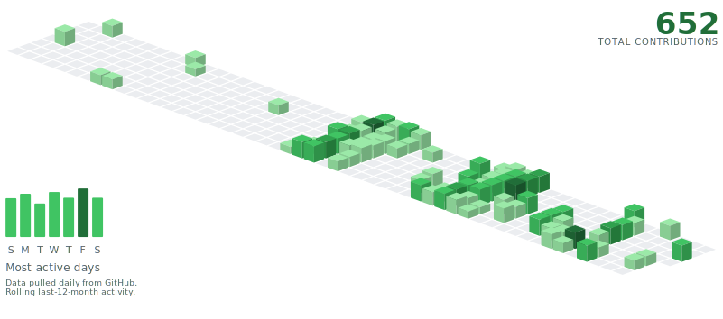

# GitHub Contribution Art
<picture>
  <source
    media="(prefers-color-scheme: dark)"
    srcset="output/contribs-dark.svg"
  />
  
</picture>

This repo generates isometric SVG versions of the GitHub contribution graph for a profile README.

> [!NOTE]
> This is a fork of another repo. I have some annotations over the original readme instruction for my own use. 

The generated assets live here:

- `output/contribs-light.svg`
- `output/contribs-dark.svg`

Your actual profile README should live in a separate public repository named exactly:

- `your-username/your-username`

## How It Works

1. `generate_contribs.py` fetches your contribution calendar from the GitHub GraphQL API.
2. It renders light and dark SVG variants into `output/`.
3. The GitHub Actions workflow runs once a day and commits refreshed SVGs back to this repo.
4. Your profile README embeds those SVGs from the raw GitHub URLs.

## Height And Color Model

This project intentionally treats color and height differently:

- Color matches GitHub's native contribution intensity buckets via `contributionLevel`
- Height uses the raw daily `contributionCount` with a logarithmic curve

Why do that?

- A single contribution should still feel visually meaningful in 3D
- Higher-count days should keep getting taller
- Extremely busy days should not become absurd spikes that dominate the whole graphic

So two days can share the same GitHub color bucket but still have different heights here.

In short:

- color = GitHub-style intensity
- height = softened contribution volume

If you want a stricter “exactly GitHub, but extruded” version, you can swap the height logic to use `contributionLevel` instead of `contributionCount`.

## Local Preview

Use a temporary output directory so you do not accidentally overwrite the tracked production SVGs while experimenting.

### Mock preview

```bash
python3 generate_contribs.py --mock --out ./tmp/mock-output
```

### Live preview

```bash
GH_README_TOKEN=your_token_here GITHUB_USER=your_username python3 generate_contribs.py --out ./tmp/live-output
```

Open the generated files in your browser:

```bash
open ./tmp/live-output/contribs-dark.svg
open ./tmp/live-output/contribs-light.svg
```

## GitHub Setup

### 1. Fork this repo

Fork this repo into your own GitHub account.

Your fork becomes the public asset repo that stores the generated SVGs. Example:

- `your-username/github-readme`

### 2. Add the Actions secret

In `your-username/github-readme`:

1. Go to `Settings -> Secrets and variables -> Actions`
2. Create a repository secret named `GH_README_TOKEN`
3. Paste a GitHub personal access token

If you want private contributions included, use a token with enough access to read them. If the secret is missing, the workflow falls back to the built-in `GITHUB_TOKEN`, which is usually only good for public-only data.

> [!NOTE]
> Apparently, a "fine-grained" GitHub personal access token is more recommended than a "classic" token.   
> So, I used the former, with permissions set to all repos (not public only), with NO special permissions.   


### 3. Enable Actions

In the repo:

1. Open the `Actions` tab
2. Enable workflows if GitHub prompts you to
3. Run `Update Contribution Art` once manually with `Run workflow`

> [!NOTE]
> At first, I couldn't find the `Update Contribution Art` nor `Run workflow` button.  
> I could only see `0 workflow runs` and `New Workflow` button in the "Actions" tab of the repo.   
> This was solved by going into **`All Workflows`** dropdown.  
> Only then I finally saw `Update Contribution Art` and `Run workflow`.  


After that, the workflow also runs every day on this schedule:

- `17 6 * * *` UTC

> [!NOTE]
> This means the workflow runs every day at 06:17 UTC.
> In Asia/Bangkok timezone, that is 1:17 PM every day.
> ```text
> minute hour day-of-month month day-of-week
>  17     6    *            *     *
> ```


### 4. Make sure your fork is public

The asset repo must be public, or the raw SVG URLs will return `404`.

## Profile README Setup

Create your profile README repo if you do not already have one:

- `your-username/your-username`

That repo must be public and contain a root `README.md`.

Add this snippet to that README:

```html
<picture>
  <source
    media="(prefers-color-scheme: dark)"
    srcset="https://raw.githubusercontent.com/your-username/github-readme/main/output/contribs-dark.svg"
  />
  
</picture>
```

Replace:

- `your-username/github-readme` with your asset repo

If GitHub shows a `Share to profile` button on the `your-username/your-username` repo page, click it.

## Files

- [generate_contribs.py](/Users/afx/Documents/GitHub/github-readme/generate_contribs.py): fetches GitHub data and renders the SVGs
- [.github/workflows/update-contribs.yml](/Users/afx/Documents/GitHub/github-readme/.github/workflows/update-contribs.yml): regenerates and commits the SVGs every day
- `output/contribs-light.svg` and `output/contribs-dark.svg`: generated assets committed by the workflow
