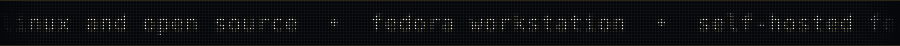

# GitHub Profile Components

This repository generates the visual components used by the separate
[`sasta-kro/sasta-kro`](https://github.com/sasta-kro/sasta-kro) profile README.
The generators remain independent modules while their generated assets are
published from the stable root `output/` directory.

<div align="center">

<picture>
  <source media="(prefers-color-scheme: dark)" srcset="terminal-animation/assets/wordmark-dark.svg">
  
</picture>

<p>
  
  
  
  
  
</p>

</div>




## My GitHub Activity in 3D

The height uses a logarithmic curve so a few unusually busy days do not dominate the graph.

<picture>
  <source media="(prefers-color-scheme: dark)" srcset="output/contribs-dark.svg">
  
</picture>

## Repository Structure

- [`terminal-animation/`](terminal-animation/README.md) owns the animated wordmark, ticker, terminal renderer, Fedora artwork, and terminal configuration.
- [`3d-contributions/`](3d-contributions/README.md) owns the GitHub contribution data fetcher and SVG renderer.
- `output/` is the public interface consumed by the profile README.
- [`.github/workflows/update-profile-assets.yml`](.github/workflows/update-profile-assets.yml) regenerates and commits the public assets.

The profile README should embed the files from `output/` using raw URLs from the
`main` branch. It should not depend on internal module paths unless the asset is
intentionally published there.

## Generate Locally

Python 3.12 or newer and ffmpeg are required.

```bash
python3 -m venv .venv
.venv/bin/python -m pip install -r terminal-animation/requirements.txt
.venv/bin/python terminal-animation/scripts/gen_hero.py
.venv/bin/python terminal-animation/scripts/gen_terminal.py --mock
.venv/bin/python 3d-contributions/generate_contribs.py --mock --out output
```

The virtual environment and intermediate animation frames are ignored by Git.

For live GitHub data:

```bash
GITHUB_TOKEN=your_token .venv/bin/python terminal-animation/scripts/gen_terminal.py
GH_README_TOKEN=your_token GITHUB_USER=sasta-kro .venv/bin/python 3d-contributions/generate_contribs.py --out output
```

## Automation

The workflow runs daily at `06:17 UTC` and can also be run manually. It keeps
these stable profile assets updated:

- `output/terminal.gif`
- `output/contribs-dark.svg`
- `output/contribs-light.svg`

`GH_README_TOKEN` is optional for public contributions and required if private
contributions should be included. The built-in `GITHUB_TOKEN` supplies public
terminal statistics.

## Credits

The 3D contribution module is inspired by
[`colincode0/github-readme`](https://github.com/colincode0/github-readme).

The terminal and rotating crest are adapted from
[`syamxm/syamxm`](https://github.com/syamxm/syamxm). The terminal renderer uses
[`github-readme-terminal`](https://github.com/x0rzavi/github-readme-terminal).
