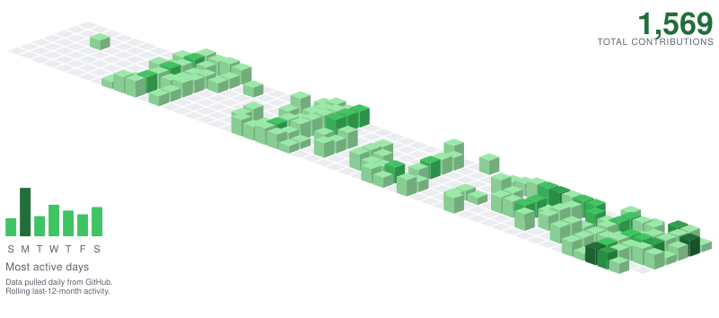

<div align="center">

<picture>
  <source media="(prefers-color-scheme: dark)" srcset="output/wordmark-dark.svg">
  
</picture>

<p>
  
  
  
  
  
  
  
  
</p>

</div>




## Hey, I'm Sai Aike. Sasta for short.

I build and maintain infrastructure, developer platforms, and backend systems.
I started with Android and Kotlin, then kept moving down the stack into Linux,
containers, networking, and the systems that software runs on.

I work mainly with Go, Python, Docker, PostgreSQL, and Fedora Linux. I am
currently a DevOps intern and a computer science student at AU.

### Selected work

- [AUSE Discovery](https://github.com/sasta-kro/ause-discover)
  A searchable archive of AU senior projects built with Go, PostgreSQL,
  Meilisearch, React, contract-generated API clients, integration tests,
  Playwright, and automated releases.

- [Corvus](https://github.com/sasta-kro/corvus-paas)
  A self-hosted PaaS that turns uploaded projects or GitHub repositories into
  live deployments using Go, Docker, Traefik, and Cloudflare Tunnel.

- [Shortform Media Pipeline](https://github.com/sasta-kro/shortform-media-pipeline)
  A Python pipeline for Thai short-form media generation using structured AI
  output, speech alignment, multilingual typography, and FFmpeg compositing.

### My GitHub Activity in 3D

<sup>The height uses a logarithmic curve so unusually active days do not dominate the graph.</sup>

<picture>
  <source media="(prefers-color-scheme: dark)" srcset="output/contribs-dark.svg">
  
</picture>

[LinkedIn](https://www.linkedin.com/in/sai-aike-shwe-tun-aung/) ·
[Email](mailto:sai.aike.shwe.tun.aung@gmail.com)

---

## About This Repository

This repository generates the visual components consumed by the separate
[`sasta-kro/sasta-kro`](https://github.com/sasta-kro/sasta-kro) profile README.
The generators remain independent modules while all profile-facing assets are
published through the stable root `output/` directory.

### Repository structure

- [`terminal-animation/`](terminal-animation/README.md) owns the animated wordmark, ticker, terminal renderer, Fedora artwork, and terminal configuration.
- [`3d-contributions/`](3d-contributions/README.md) owns the GitHub contribution data fetcher and SVG renderer.
- `output/` is the public interface consumed by the profile README.
- [`.github/workflows/update-profile-assets.yml`](.github/workflows/update-profile-assets.yml) regenerates and commits the public assets.

### Generate locally

Python 3.12 or newer and ffmpeg are required.

```bash
python3 -m venv .venv
.venv/bin/python -m pip install -r requirements.txt
.venv/bin/python terminal-animation/scripts/gen_hero.py
.venv/bin/python terminal-animation/scripts/gen_terminal.py --mock
.venv/bin/python 3d-contributions/generate_contribs.py --mock --out output
```

For live GitHub data:

```bash
GITHUB_TOKEN=your_token .venv/bin/python terminal-animation/scripts/gen_terminal.py
GH_README_TOKEN=your_token GITHUB_USER=sasta-kro .venv/bin/python 3d-contributions/generate_contribs.py --out output
```

The virtual environment and intermediate animation frames are ignored by Git.

### Automation

The workflow runs daily at `06:17 UTC` and can also be run manually. It updates:

- `output/hero-dark.svg`
- `output/hero-light.svg`
- `output/wordmark-dark.svg`
- `output/wordmark-light.svg`
- `output/ticker.svg`
- `output/terminal.gif`
- `output/contribs-dark.svg`
- `output/contribs-light.svg`

`GH_README_TOKEN` is optional for public contributions and required if private
contributions should be included. The built-in `GITHUB_TOKEN` supplies public
terminal statistics.

### Credits

The 3D contribution module is inspired by
[`colincode0/github-readme`](https://github.com/colincode0/github-readme).

The terminal and rotating crest are adapted from
[`syamxm/syamxm`](https://github.com/syamxm/syamxm). The terminal renderer uses
[`github-readme-terminal`](https://github.com/x0rzavi/github-readme-terminal).
